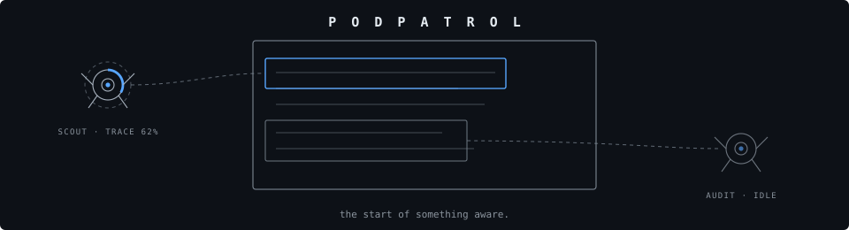
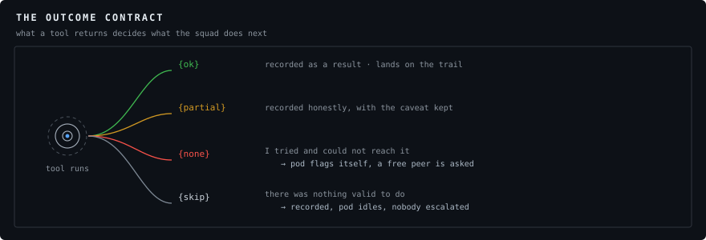

# podpatrol

**the start of something aware.**


An autonomous support-pod overlay for any web interface. Small agents that live
*on top of* your UI: they dock at the screen edges, undock to work on elements
you point them at, tether and spotlight what they are working on, interrupt with
a lightning arc, vote among themselves before acting, and answer plain-language
questions in character.

One file. No dependencies. No build step.

The point is not decoration. A spinner hides work, and hidden work is
indistinguishable from nothing happening. A pod flying to the paragraph it is
checking, filling a progress arc at the speed of the real fetch, and then
reporting what it found — that is the same latency rendered as visible labour.
It also buys honesty for free: when a claim ends up marked *disputed*, you
watched the pod try to verify it and fail, so the caveat is earned rather than
boilerplate.

---

## Install

```html
<script src="podpatrol.js"></script>
```

## Two ways to use it

**Custom element — zero JS.** The element uses its `parentElement` as the host box.

```html
<div style="position:relative">
  <article data-pod-target="clause1" data-pod-name="Termination clause">…</article>
  <article data-pod-target="clause2" data-pod-name="Liability cap">…</article>
  <pod-patrol autonomy="quorum" scroller="#doc"></podpatrol>
</div>
```

**Class — full control.**

```js
const squad = new PodPatrol({ host, scroller });
squad.on('record', e => log(e.detail));      // public activity log
squad.on('tap',    e => openChat(e.detail.pod));
squad.assign('audit', 'VERIFY', clauseEl);
```

---

## Real work: the tool registry

Verbs are yours. A tool owns its own duration and outcome, so the progress arc
reflects actual work rather than a countdown.

```js
squad.tool('TRACE', async (ctx) => {
  const hits = await search(ctx.text);   // ctx.text / .el / .label / .pod
  ctx.progress(0.6);                     // drives the pod's arc
  ctx.log('61 in, 3 kept');              // shows on its label
  if (ctx.cancelled()) return;           // true after a stand-down
  return hits.length ? { ok: hits } : { none: 'no primary source' };
});
```



### Outcomes are a contract

| Return | Meaning | Behaviour |
|---|---|---|
| `{ok}` | it worked | result on the record and the trail |
| `{partial}` | worked, with a caveat | same, phrased honestly |
| `{none}` | **I tried and could not reach it** | escalates: pod flags itself and asks a free peer |
| `{skip}` | **there was nothing valid to do** | recorded, pod returns to idle, escalates to nobody |
| `throw` | failure | treated as `{none}` |
| `return` (nothing) | success | uses the verb's default text |

The `none` / `skip` distinction is load-bearing. A precondition refusal returned
as `none` manufactures a blockage, drags in a peer, and the assist then claims to
have "reached what they could not" — a fabricated resolution. Use `skip` when the
work was never possible.

A returned value reaches `taskdone.result`, so structured findings are usable.

---

## Reasoning: let a model choose

```js
squad.brain(async ctx => JSON.parse(await callModel(ctx.prompt())));
```

`ctx` carries the pod's persona traits, current state, peers and their states,
available verbs, on-page targets, registered tools, the squad's recent record,
and `ctx.mine` — that pod's own last few trail stops, so it builds on what it
already found. `ctx.prompt()` is a ready-made prompt for the common case.

Return `{reply, verb, target, ask}`: the reply is spoken in that pod's voice,
`verb` dispatches through the same `assign()` path as a manual order, `ask` hands
the job to a named peer. On a throw or timeout the rule engine answers instead —
the squad never goes mute.

---

## Self-scaffolding: plan, then run

```js
const plan = await squad.plan('document how we rotate a leaked API key');
squad.run(plan.jobs);                    // dependency-aware, parallel
squad.addJobs([...], /* front */ true);  // mid-run revision
```

`plan()` asks the planner (your brain fn by default) to invent the artifact list
*and* the job graph for a goal it has never seen — including acceptance criteria
per artifact and which checks each job advances. Nothing runs unvalidated:
unknown verbs and pods are dropped and counted, dependencies on dropped jobs are
pruned, and a plan with no runnable jobs is reported as a failure.

`run()` dispatches every job whose `after` dependencies are satisfied to any free
pod, so independent work happens simultaneously. It never interrupts a working
pod. A failure resolves its job for dependency purposes — otherwise dependents
wait forever — and a stall watchdog ends an unrunnable run instead of spinning.

---

## Personality that is read, not decorative

```js
{ id:'audit', label:'AUDIT', color:'#c07a12', persona:{
    voice:  { pitch:.86, rate:.94, match:/daniel|male/i },
    model:  { temperature:0.1, system:'…' },
    traits: { agreeable:.5, terse:.9, warmth:.1, hedge:.2, pushback:.9 },
    lines:  { ack:['Mine.'], thanks:['Check my work instead.'] },
    tic:    'Logged.'
}}
```

- `agreeable` **is** the pod's quorum vote probability
- `terse` makes it pick the shortest line from every pool
- `warmth` decides whether it accepts thanks or deflects
- `hedge` appends caveats
- `pushback` refuses vague instructions

`model` is passed through verbatim to your backend (`squad.modelFor(id)`), so
each pod can be a different model at a different temperature.

---

## Default roster

The library ships with **SCOUT / AUDIT / ARCHIVE / FORGE** as an *example* roster — a
researcher, a checker, a memory and a builder. They are a starting point, not a
prescription: pass your own `pods` array with whatever roles your product actually
needs. The only thing the engine cares about is that each pod has an id, a label, a
colour, and optionally a persona.

## Autonomy

| Mode | Behaviour |
|---|---|
| `leash` | orders only; no standing beats |
| `quorum` | pods vote among themselves and proceed; you may veto |
| `auto` | they act and log it, no vote |

Under `quorum` a proposal triggers a real vote — peers concur or dissent
according to their `agreeable` trait — and carries on a majority. A split
escalates to you via the `proposal` event.

---

## Standing orders (DSL)

For end users authoring behaviour without JS:

```
# comments and blank lines are fine
on finding: editor VERIFY it
on blocked(audit): say "I can take a look."
on idle(scout) every 25s: TRACE random
every 40s: forge SUMMARIZE newest
```

`[on EVENT[(pod,…)]] [every Ns] : [pod] (VERB [target] | say "…")`
Targets: `it` (the event's element), `newest`, `random`, or a target id.
Rules are rate-limited and never interrupt a working pod.

```js
const handle = squad.script(src);   // {rules, errors, stop()}
```

---

## History and trails

`squad.history()` is the unified chronological record — every entry timestamped
(`time`, `iso`, `elapsed`, monotonic `seq`) with its pod, verb, outcome, and the
element it touched. `squad.trailFor(id)` is one pod's stops, where a stop is a
place work actually happened. `squad.showTrail(id | 'all' | null)` draws it: a
dashed path through the elements that pod worked on, with a numbered bubble at
each stop summarising it.

Observations are recorded as `kind:'finding'` with verb `NOTICED` — a standing
beat looked at something, it did not change it, and it must not claim otherwise.

---

## Sound and voice

Ship with it, synthesized, no asset files: a low shell hum, relay clicks, a
sonar ping pitched per pod, sweeps, crackle on interruption, a chord on quorum,
an alert on a block. Speech is queued so a burst reads as turn-taking, with a
watchdog for browsers that wedge `speechSynthesis`. Voices are cast so N pods
read as N people rather than one voice detuned.

```js
squad.setAudio(false);   // mute cues + hum
squad.setVoice(false);   // mute speech only
new PodPatrol({ audio:false, voice:false });  // silent; wire the 'say' event
```

Audio unlocks on the first user gesture, per browser policy.

---

## Presence

At rest pods sit at `restOpacity` (default 0.2) so they never fight the content,
and labels hide themselves when they would cover text. Hold the reveal key
(default <kbd>Alt</kbd>) to bring the squad to full opacity; pods that are
off-screen or clipped get a named bubble pinned inside the visible area with an
arrow pointing back at them. Pods yield the scroll for a few seconds after any
scroll input of yours — an agent that fights your wheel feels like losing control
of the page.

---

## Events

`record` · `say` · `tap` · `drop` · `taskstart` · `taskdone` · `taskskip` ·
`taskfail` · `blocked` · `cutin` · `finding` · `vote` · `beat` · `proposal` ·
`quorum` · `persona` · `model` · `plan` · `runstart` · `jobstart` · `jobqueued` ·
`runend` · `trail` · `trailadd` · `script` · `thinking` · `brain` · `brainerror` ·
`autonomy` · `reveal`

Also dispatched on the host element as `pod-<name>`, bubbling.

---

## API

```
new PodPatrol({host, scroller, pods, verbs, autonomy, podSize, labels, podBg,
              labelBg, restOpacity, revealKey, targetAttr, beatInterval,
              maxHistory, audio, voice, volume})

tool(verb, fn, meta?)      hasTool(verb)
assign(pod, verb, target, opts?)          standDown(pod)
cutIn(pod, target, ms, text)              spotlight(target)
scrollTo(target, ms?)                     yieldScroll(ms?)
brain(fn, opts?)  hasBrain()  talk(pod, text)  talkAsync(pod, text)
plan(goal, opts?)  planner(fn)
run(jobs, opts?)  addJobs(jobs, front?)  queued()  stopRun()  isRunning()
script(src)
setAutonomy(mode)  beat()  propose(pod, proposal)  approve()  decline()  veto()
setPersona(pod, persona)  setModel(pod, cfg)  modelFor(pod)  say(pod, text)
history(filter?)  trailFor(pod)  showTrail(ref)  clearHistory()
targets()  get(ref)  setAudio(on)  setVoice(on)  setReveal(on)  destroy()
PodPatrol.looseJSON(str)     // tolerant JSON for truncated model replies
```

---

## Tests

`tests/index.html` — 34 cases, each named after a bug this library
actually shipped, run against a live squad on a real host with stubbed tools.
Verbose mode shows every assertion and the test's own source.

**The rule: when a bug is found, add a case before fixing it.** A suite that only
tests what already works will not catch the next one.

---

## Demos

| File | What it shows |
|---|---|
| `demos/guide-build.html` | The squad plans its own artifacts with acceptance criteria, then drafts, checks and argues through them. Runs stubbed; add an OpenRouter key to make it live. |
| `index.html` | Landing page, ready for GitHub Pages |

Open `demos/guide-build.html` directly from a clone — no server needed.

---

## License

MIT © David Maynor
